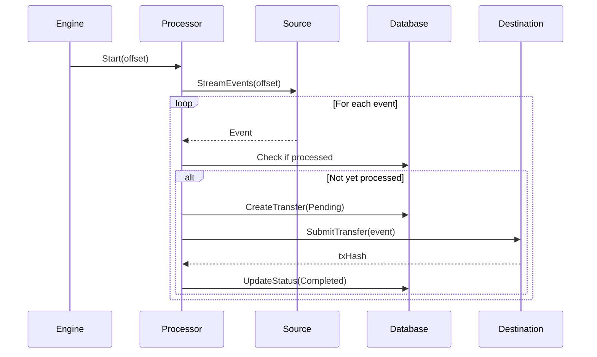

# Canton Middleware Architecture

This document describes how MetaMask, the API Server, the Relayer, and the Canton Ledger work together to enable ERC-20 compatible token operations on Canton Network.

---

## System Overview

```
┌─────────────────────────────────────────────────────────────────────────────┐
│                              USER LAYER                                      │
│                                                                              │
│    ┌──────────────────┐                      ┌──────────────────┐           │
│    │  🦊 MetaMask     │                      │  Native Canton   │           │
│    │  (EVM Wallet)    │                      │  User / CLI      │           │
│    └────────┬─────────┘                      └────────┬─────────┘           │
│             │ eth_sendRawTransaction                  │ Direct gRPC         │
│             │ eth_call, eth_getBalance                │ (or via scripts)    │
└─────────────┼─────────────────────────────────────────┼─────────────────────┘
              │                                         │
              ▼                                         │
┌─────────────────────────────────────────────────────────────────────────────┐
│                           MIDDLEWARE LAYER                                   │
│                                                                              │
│  ┌─────────────────────────────┐      ┌─────────────────────────┐           │
│  │      API SERVER             │      │        RELAYER          │           │
│  │      (Port 8081)            │      │    (Background Service) │           │
│  │                             │      │                         │           │
│  │  • /eth - JSON-RPC facade   │      │  • Ethereum → Canton    │           │
│  │  • /register - User signup  │      │  • Canton → Ethereum    │           │
│  │  • /health - Status check   │      │  • Event processing     │           │
│  │                             │      │                         │           │
│  │  Custodial key management:  │      │  Bridges PROMPT token   │           │
│  │  Holds Canton keys for all  │      │  between chains         │           │
│  │  registered users           │      │                         │           │
│  └──────────────┬──────────────┘      └──────────────┬──────────┘           │
│                 │                                    │                       │
│                 └─────────────┬───────────────────────┘                      │
│                               │                                              │
│                    ┌──────────▼──────────┐                                   │
│                    │     PostgreSQL      │                                   │
│                    │     (Port 5432)     │                                   │
│                    │                     │                                   │
│                    │  • User registry    │                                   │
│                    │  • Balance cache    │                                   │
│                    │  • Transfer state   │                                   │
│                    │  • Chain offsets    │                                   │
│                    └──────────┬──────────┘                                   │
└───────────────────────────────┼──────────────────────────────────────────────┘
                                │
              gRPC + OAuth2     │
                                ▼
┌─────────────────────────────────────────────────────────────────────────────┐
│                         CANTON LEDGER                                        │
│                        (Source of Truth)                                     │
│                                                                              │
│  ┌───────────────────────────────────────────────────────────────────────┐  │
│  │                      DAML Smart Contracts (CIP-56)                     │  │
│  │                                                                        │  │
│  │  ┌──────────────────┐  ┌──────────────────┐  ┌──────────────────┐     │  │
│  │  │ FingerprintMapping│  │   CIP56Holding   │  │    TokenMeta     │     │  │
│  │  │                  │  │                  │  │                  │     │  │
│  │  │ Links EVM addr   │  │ Actual token     │  │ DEMO: Native     │     │  │
│  │  │ to Canton Party  │  │ balances per     │  │ PROMPT: Bridged  │     │  │
│  │  │                  │  │ user per token   │  │                  │     │  │
│  │  └──────────────────┘  └──────────────────┘  └──────────────────┘     │  │
│  └───────────────────────────────────────────────────────────────────────┘  │
│                                                                              │
│  Ports: 5011 (gRPC), 5013 (HTTP)                                            │
└─────────────────────────────────────────────────────────────────────────────┘
                                ▲
                                │ Bridge Events (PROMPT only)
                                │
┌─────────────────────────────────────────────────────────────────────────────┐
│                    ETHEREUM (Anvil Local / Sepolia Testnet)                  │
│                                                                              │
│  ┌──────────────────────────┐    ┌──────────────────────────┐               │
│  │    Bridge Contract       │◄───│    PROMPT Token          │               │
│  │                          │    │    (ERC-20)              │               │
│  │  • depositToCanton()     │    │                          │               │
│  │  • withdrawToEthereum()  │    │  Local: 0x5FbDB231...    │               │
│  │                          │    │                          │               │
│  │  Local: 0xe7f1725E...    │    │                          │               │
│  └──────────────────────────┘    └──────────────────────────┘               │
│                                                                              │
│  Port: 8545 (Anvil)                                                         │
└─────────────────────────────────────────────────────────────────────────────┘
```

---

## Components

### API Server

The API Server provides an **Ethereum JSON-RPC compatible interface** that allows MetaMask and other EVM wallets to interact with Canton tokens.

| Endpoint | Purpose |
|----------|---------|
| `/eth` | JSON-RPC facade (eth_call, eth_sendRawTransaction, etc.) |
| `/register` | User registration with EIP-191 signature |
| `/health` | Health check endpoint |

**Key responsibilities:**
- Translate ERC-20 calls to CIP-56 DAML operations
- Manage custodial Canton keys for all registered users
- Cache balances in PostgreSQL for fast queries
- Reconcile database cache with Canton ledger periodically

### Relayer

The Relayer bridges PROMPT tokens between Ethereum and Canton.

**Bidirectional processing:**
- **Ethereum → Canton**: Watches for `depositToCanton()` events, mints CIP-56 tokens
- **Canton → Ethereum**: Watches for withdrawal requests, releases ERC-20 tokens

**Design principles:**
- At-least-once delivery with idempotency
- Crash recovery via persisted offsets
- Database-backed deduplication

### PostgreSQL Database

Serves as a **distributed indexer** and cache:
- User registry (EVM address ↔ Canton Party mapping)
- Balance cache for fast MetaMask queries
- Transfer state tracking for idempotency
- Chain offsets for crash recovery

### Canton Ledger

The **source of truth** for all token balances.

**DAML Contracts:**
- `FingerprintMapping` - Links EVM addresses to Canton parties
- `CIP56Holding` - Actual token balances (one contract per user per token)
- `TokenMeta` - Token configuration (DEMO native, PROMPT bridged)

---

## Token Types

| Token | Type | Virtual Address | Description |
|-------|------|-----------------|-------------|
| **DEMO** | Native Canton | `0xDE30000000000000000000000000000000000001` | Created directly on Canton |
| **PROMPT** | Bridged ERC-20 | `0x5FbDB2315678afecb367f032d93F642f64180aa3` | Bridged from Ethereum |

---

## Data Flows

### Flow 1: MetaMask Transfer (DEMO or PROMPT)

User sends tokens to another user via MetaMask.

```
┌──────────┐     ┌───────────┐     ┌──────────┐     ┌────────┐
│ MetaMask │     │API Server │     │PostgreSQL│     │ Canton │
└────┬─────┘     └─────┬─────┘     └────┬─────┘     └───┬────┘
     │                 │                │               │
     │ eth_sendRawTx   │                │               │
     │ (ERC-20 transfer)               │               │
     │────────────────>│                │               │
     │                 │                │               │
     │                 │ Decode tx, verify whitelist    │
     │                 │ Get sender/recipient parties   │
     │                 │────────────────>│               │
     │                 │                │               │
     │                 │ TransferAsUserByFingerprint    │
     │                 │───────────────────────────────>│
     │                 │                │               │
     │                 │                │  CIP56 Transfer
     │                 │                │  (exercises choice)
     │                 │                │               │
     │                 │<──────────────────────────────│
     │                 │                │               │
     │                 │ Update balance cache           │
     │                 │────────────────>│               │
     │                 │                │               │
     │  tx receipt     │                │               │
     │<────────────────│                │               │
     │                 │                │               │
```

### Flow 2: Bridge Deposit (Ethereum → Canton)

User deposits PROMPT tokens from Ethereum to Canton.

```
┌──────────┐     ┌──────────┐     ┌─────────┐     ┌──────────┐     ┌────────┐
│   User   │     │ Ethereum │     │ Relayer │     │PostgreSQL│     │ Canton │
└────┬─────┘     └────┬─────┘     └────┬────┘     └────┬─────┘     └───┬────┘
     │                │                │               │               │
     │ depositToCanton()               │               │               │
     │───────────────>│                │               │               │
     │                │                │               │               │
     │                │ Emit Deposit event             │               │
     │                │───────────────>│               │               │
     │                │                │               │               │
     │                │                │ Check if processed            │
     │                │                │───────────────>│               │
     │                │                │               │               │
     │                │                │ Create pending transfer       │
     │                │                │───────────────>│               │
     │                │                │               │               │
     │                │                │ BridgeMint (CIP56)            │
     │                │                │──────────────────────────────>│
     │                │                │               │               │
     │                │                │               │  Create Holding
     │                │                │               │               │
     │                │                │<─────────────────────────────│
     │                │                │               │               │
     │                │                │ Update status = completed     │
     │                │                │───────────────>│               │
     │                │                │               │               │
```

### Flow 3: Balance Reconciliation

API Server syncs database cache with Canton ledger.

```
┌───────────┐     ┌──────────┐     ┌────────┐
│API Server │     │PostgreSQL│     │ Canton │
└─────┬─────┘     └────┬─────┘     └───┬────┘
      │                │               │
      │ GetAllCIP56Holdings            │
      │───────────────────────────────>│
      │                │               │
      │<──────────────────────────────│
      │  [list of all holdings]        │
      │                │               │
      │ Group by party, sum by token   │
      │                │               │
      │ For each registered user:      │
      │ UpdateBalanceByCantonPartyID   │
      │───────────────>│               │
      │                │               │
      │ Repeat...      │               │
      │───────────────>│               │
      │                │               │
```

---

## Relayer Processor Pattern

The Relayer uses a generic **Processor** pattern for bidirectional event handling:



**Two processor instances:**
1. **Canton → Ethereum**: `CantonSource` + `EthereumDestination`
2. **Ethereum → Canton**: `EthereumSource` + `CantonDestination`

---

## Canton Integration

### gRPC Ledger API

The middleware connects to Canton via the **Daml Ledger gRPC API v2**:

```
Canton Participant Node
    │
    ├── Ledger API (gRPC, port 5011)
    │   ├── CommandService - Submit transactions
    │   ├── UpdateService - Stream events  
    │   └── StateService - Query active contracts
    │
    └── HTTP API (port 5013) - Health/version checks
```

**Why gRPC (not JSON API):**
- First-class, production-grade API
- Streaming with offsets for reliability
- Built-in deduplication via command IDs
- Generated Go stubs from protobuf definitions

### Authentication

Canton uses **JWT-based authorization** (not client-side transaction signing):

```go
// JWT claims structure
{
  "actAs": ["BridgeOperatorParty"],  // Can submit commands
  "readAs": ["BridgeOperatorParty"], // Can read events
  "exp": 1234567890
}
```

The participant node handles internal signing. The middleware authenticates via OAuth2 to obtain JWT tokens.

---

## Relayer Design Principles

### Core Philosophy

1. **Bidirectional & Independent** - Two separate one-way flows that don't depend on each other
2. **At-Least-Once Delivery** - Every event is guaranteed to be processed at least once
3. **Idempotency** - Database-backed deduplication prevents duplicate processing
4. **Crash Recovery** - Persisted offsets allow resuming from exact position after restart

### State Management

**Offsets (Checkpoints):**
- Canton: `LedgerOffset` (absolute string)
- Ethereum: `BlockNumber`
- Stored in `chain_state` table
- Updated only after successful processing

**Idempotency:**
- Every event has a unique ID
- Canton→Eth: Canton Event ID
- Eth→Canton: Hash of `(TxHash, LogIndex)`
- Checked against `transfers` table before processing

### Reconciliation

The API Server runs periodic reconciliation (every 5 minutes):
1. Query all `CIP56Holding` contracts from Canton
2. Group by party and token
3. Update cached balances in PostgreSQL
4. Log any stuck transfers for investigation

---

## Key Design Decisions

### 1. Custodial Key Management (secp256k1)

The API Server generates and holds **secp256k1** Canton signing keys for all users:
- Same elliptic curve as Ethereum (enables future MetaMask Snap integration)
- Keys encrypted at rest with `CANTON_MASTER_KEY`
- Stored in PostgreSQL `users` table

This enables MetaMask users to interact without Canton tooling. Trade-off: Users trust the API Server with their Canton keys.

### 2. PostgreSQL as Cache, Canton as Source of Truth

- Fast balance queries from PostgreSQL
- Periodic reconciliation ensures consistency
- Canton ledger is always authoritative

### 3. Fingerprint-Based Identity

Users are identified by `keccak256(evmAddress)`:
- Links EVM identity to Canton party
- Enables cross-chain user lookup
- Stored in `FingerprintMapping` DAML contract

### 4. Virtual Token Addresses

Native Canton tokens use synthetic addresses:
- DEMO: `0xDE30000000000000000000000000000000000001`
- Allows MetaMask to "import" Canton-native tokens

---

## Ports Summary

| Service | Port | Protocol |
|---------|------|----------|
| API Server | 8081 | HTTP (JSON-RPC) |
| Anvil (Ethereum) | 8545 | HTTP (JSON-RPC) |
| Canton gRPC | 5011 | gRPC |
| Canton HTTP | 5013 | HTTP |
| PostgreSQL | 5432 | PostgreSQL |
| Relayer Metrics | 9090 | HTTP |
