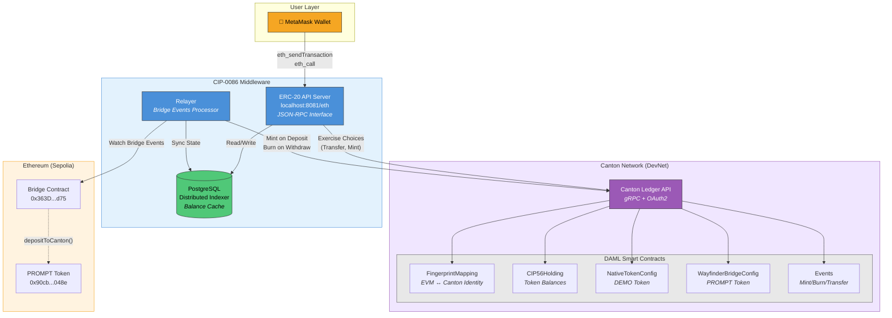

# CIP-0086 Architecture Diagram

## Mermaid Diagram (render at mermaid.live or in GitHub)



---

## ASCII Version (for terminals/simple display)

```
┌─────────────────────────────────────────────────────────────────────────────┐
│                           CIP-0086 ARCHITECTURE                             │
└─────────────────────────────────────────────────────────────────────────────┘

    ┌──────────────────┐
    │  🦊 MetaMask     │
    │  (Any EVM Wallet)│
    └────────┬─────────┘
             │ eth_sendTransaction
             │ eth_call, eth_getBalance
             ▼
┌────────────────────────────────────────────────────────────────────────────┐
│                         CIP-0086 MIDDLEWARE                                 │
│  ┌─────────────────────────┐      ┌─────────────────────────┐              │
│  │   ERC-20 API Server     │      │       Relayer           │              │
│  │   localhost:8081/eth    │      │   Bridge Event Watcher  │              │
│  │                         │      │                         │              │
│  │  • JSON-RPC Interface   │      │  • Sepolia → Canton     │              │
│  │  • Transfer Execution   │      │  • Deposit/Withdraw     │              │
│  │  • Balance Queries      │      │  • Event Sync           │              │
│  └───────────┬─────────────┘      └───────────┬─────────────┘              │
│              │                                │                             │
│              └──────────┬─────────────────────┘                             │
│                         │                                                   │
│              ┌──────────▼──────────┐                                        │
│              │     PostgreSQL      │                                        │
│              │  Distributed Indexer│                                        │
│              │  (Balance Cache)    │                                        │
│              └──────────┬──────────┘                                        │
└─────────────────────────┼──────────────────────────────────────────────────┘
                          │ gRPC + OAuth2
                          ▼
┌────────────────────────────────────────────────────────────────────────────┐
│                        CANTON NETWORK (DevNet)                              │
│                                                                             │
│  ┌─────────────────────────────────────────────────────────────────────┐   │
│  │                      DAML Smart Contracts                            │   │
│  │                                                                      │   │
│  │  ┌──────────────────┐  ┌──────────────────┐  ┌──────────────────┐   │   │
│  │  │ FingerprintMapping│  │  CIP56Holding   │  │     Events       │   │   │
│  │  │                  │  │                  │  │                  │   │   │
│  │  │ EVM Address ←→   │  │ Token Balances   │  │ MintEvent        │   │   │
│  │  │ Canton Party     │  │ (DEMO & PROMPT)  │  │ BurnEvent        │   │   │
│  │  └──────────────────┘  └──────────────────┘  │ TransferEvent    │   │   │
│  │                                              │ BridgeMintEvent  │   │   │
│  │  ┌──────────────────┐  ┌──────────────────┐  │ BridgeBurnEvent  │   │   │
│  │  │NativeTokenConfig │  │WayfinderBridge   │  └──────────────────┘   │   │
│  │  │                  │  │    Config        │                         │   │
│  │  │ DEMO Token       │  │ PROMPT Token     │                         │   │
│  │  │ (Native Canton)  │  │ (Bridged ERC-20) │                         │   │
│  │  └──────────────────┘  └──────────────────┘                         │   │
│  └─────────────────────────────────────────────────────────────────────┘   │
└────────────────────────────────────────────────────────────────────────────┘
                          ▲
                          │ Bridge Events
                          │
┌─────────────────────────┴──────────────────────────────────────────────────┐
│                        ETHEREUM (Sepolia Testnet)                           │
│                                                                             │
│  ┌──────────────────────────┐    ┌──────────────────────────┐              │
│  │    Bridge Contract       │    │    PROMPT Token          │              │
│  │  0x363Dd0b55bf74D5b...   │◄───│  0x90cb4f9eF6d682F...    │              │
│  │                          │    │                          │              │
│  │  • depositToCanton()     │    │  • ERC-20 Standard       │              │
│  │  • withdrawToEthereum()  │    │  • 18 decimals           │              │
│  └──────────────────────────┘    └──────────────────────────┘              │
└────────────────────────────────────────────────────────────────────────────┘
```

---

## Data Flow Summary

### Transfer Flow (MetaMask → Canton)
```
1. User initiates transfer in MetaMask
2. MetaMask sends eth_sendTransaction to API Server
3. API Server validates & looks up FingerprintMapping
4. API Server exercises IssuerTransfer on Canton
5. Canton creates TransferEvent + updates Holdings
6. API Server updates PostgreSQL cache
7. MetaMask shows confirmed transaction
```

### Bridge Deposit Flow (Ethereum → Canton)
```
1. User deposits PROMPT to Bridge Contract on Sepolia
2. Relayer watches for Deposit events
3. Relayer calls BridgeMint on Canton
4. Canton creates BridgeMintEvent + CIP56Holding
5. PostgreSQL cache updated
6. User sees PROMPT balance in MetaMask
```

---

## Key Components

| Component | Purpose | Port/Endpoint |
|-----------|---------|---------------|
| API Server | ERC-20 JSON-RPC interface | `localhost:8081/eth` |
| Relayer | Bridge event processor | (background service) |
| PostgreSQL | Balance cache / indexer | `localhost:5432` |
| Canton Ledger | DAML contract execution | `canton-ledger-api-grpc-dev1.chainsafe.dev:80` |
| Sepolia Bridge | Cross-chain deposits | `0x363Dd0b55bf74D5b494B064AA8E8c2Ef5eD58d75` |

---

## Token Addresses

| Token | Type | Address |
|-------|------|---------|
| DEMO | Native Canton | `0xDE30000000000000000000000000000000000001` |
| PROMPT | Bridged ERC-20 | `0x90cb4f9eF6d682F4338f0E360B9C079fbb32048e` |
