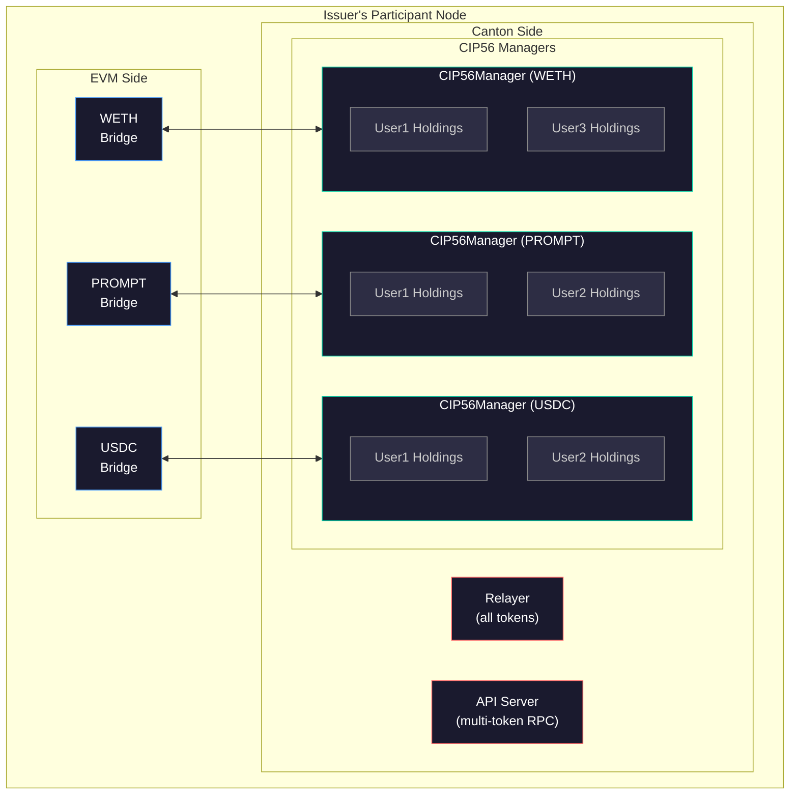

# Canton-Ethereum Bridge & ERC-20 API Server

This document describes how the Canton-Ethereum Bridge and ERC-20 API Server deliver [CIP-0086: ERC-20 Middleware and Distributed Indexer for Canton Network](https://github.com/global-synchronizer-foundation/cips/commit/9a646bce15ec273bf728f18d18ba685f30f015ad).

## The Canton-EVM Bridge

A bi-directional relay between EVM chains and Canton. On EVM, a `CantonBridge` smart contract locks tokens and emits events. On Canton, **Daml contracts** (CIP56 standard) manage holdings with native privacy and atomicity.

The **Relayer** monitors both chains:

- **Deposits (EVM → Canton):** Detects `DepositToCanton` events, resolves recipients via fingerprint mapping, mints CIP56 tokens
- **Withdrawals (Canton → EVM):** Detects `WithdrawalEvent` contracts, burns tokens, releases ERC-20s from the bridge

## The ERC-20 API Server

A JSON-RPC interface exposing Canton holdings with ERC-20 semantics. Users authenticate via EVM signatures (EIP-191), enabling MetaMask interaction without Canton tooling.

- `user_register` - Links EVM addresses to Canton parties
- `erc20_balanceOf` - Cached balance queries
- `erc20_transfer` - Canton-side transfers
- `erc20_name`, `erc20_symbol`, `erc20_totalSupply`, `erc20_decimals` - Standard metadata

A PostgreSQL cache syncs balances via relayer events and periodic reconciliation.

## Delivering CIP-0086

### ERC-20 Middleware

- Standard JSON-RPC interface (`erc20_*` methods) compatible with Web3 tooling
- EVM wallet authentication—use existing Ethereum keys with Canton
- Abstracts Daml contracts behind familiar ERC-20 semantics

### Distributed Indexer

- PostgreSQL stores aggregated balances for fast queries
- Real-time sync via relayer event processing
- Periodic reconciliation against Canton's ledger

### Cross-Chain Interoperability

- Bi-directional bridge between EVM and Canton
- Fingerprint-based identity linking
- Atomic deposit/withdrawal flows

## Issuer-Centric Privacy Model

All operations occur within the **issuer's (bridge operator's) visibility boundary**, preserving Canton's privacy model.

- The **Bridge Issuer** sees all bridge contracts (FingerprintMappings, PendingDeposits, WithdrawalEvents, Holdings)
- **User Parties** only observe their own holdings
- Relayer and API server operate **as the issuer**

### Privacy Guarantees

1. **No global visibility** - Balances aren't broadcast network-wide
2. **Issuer as custodian** - Only the operator's node indexes this data
3. **User isolation** - Users can't see each other's holdings
4. **Regulatory compliance** - KYC/AML within issuer scope, no external data exposure

The indexer operates within a **single trust boundary** (issuer's node), not network-wide. Users get ERC-20 convenience while the issuer controls data visibility—exactly as Canton intends.

## Multi-Token Bridge Operator

A single issuer can bridge **multiple EVM tokens**, letting users hold and interact with many assets simultaneously.

### Capabilities

| Capability | Description |
|------------|-------------|
| **Multi-asset portfolios** | Hold PROMPT, USDC, WETH simultaneously |
| **Unified identity** | One registration covers all bridged assets |
| **Atomic operations** | Compose transactions across token types |
| **Single API** | One endpoint for all tokens |

### Privacy Preserved

- Issuer sees all tokens, users, transfers
- Users see only their own holdings
- Other Canton participants see nothing

### Use Cases

| Operator | Value |
|----------|-------|
| **Exchange** | Canton custody with ERC-20 compatibility |
| **Asset Manager** | Private multi-token portfolios |
| **Payment Processor** | Multi-stablecoin settlements |

## References

- [CIP-0086: ERC-20 Middleware and Distributed Indexer](https://github.com/global-synchronizer-foundation/cips/commit/9a646bce15ec273bf728f18d18ba685f30f015ad)
- [Global Synchronizer Foundation CIPs](https://github.com/global-synchronizer-foundation/cips)
