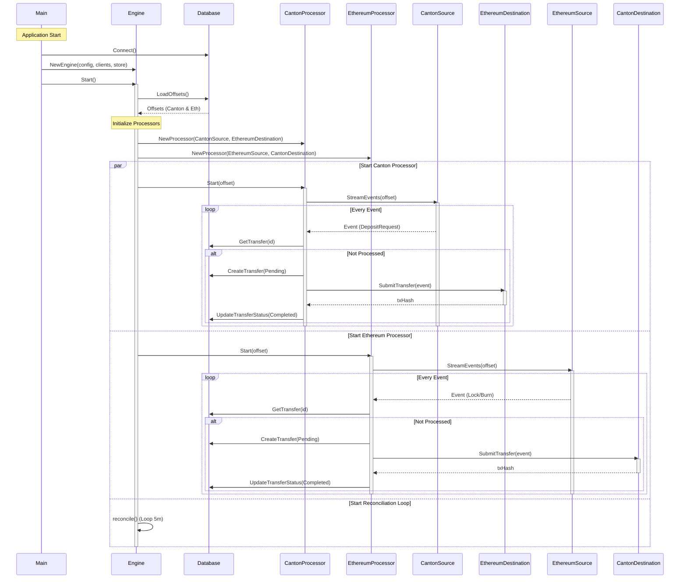

# Architecture Design

## Component Interaction Sequence Diagram

This diagram illustrates the interaction between the main components of the Canton-Ethereum Bridge Relayer, including the initialization, event streaming loops, and the core processing logic.

## Component Roles

*   **Main**: Entry point. Initializes configuration, database connection, clients, and the Engine. Starts the HTTP server for metrics/API.
*   **Engine**: Orchestrator. Manages the lifecycle of the application. It initializes the bidirectional processors and the reconciliation loop. It handles graceful shutdown.
*   **Processor**: The core worker. There are two instances: one for Canton->Ethereum and one for Ethereum->Canton. It abstracts the logic of "Listen -> Persist -> Submit".
*   **Source (Interface)**: Abstraction for fetching events (e.g., `CantonSource` streams from Canton Ledger API).
*   **Destination (Interface)**: Abstraction for submitting transactions (e.g., `EthereumDestination` submits to a smart contract).
*   **Store**: Persistence layer (PostgreSQL) for tracking transfer state and chain offsets.
