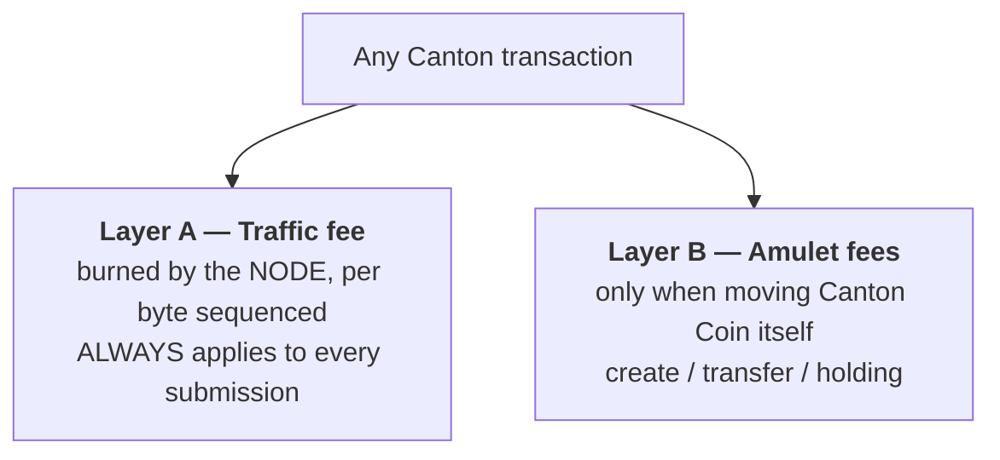
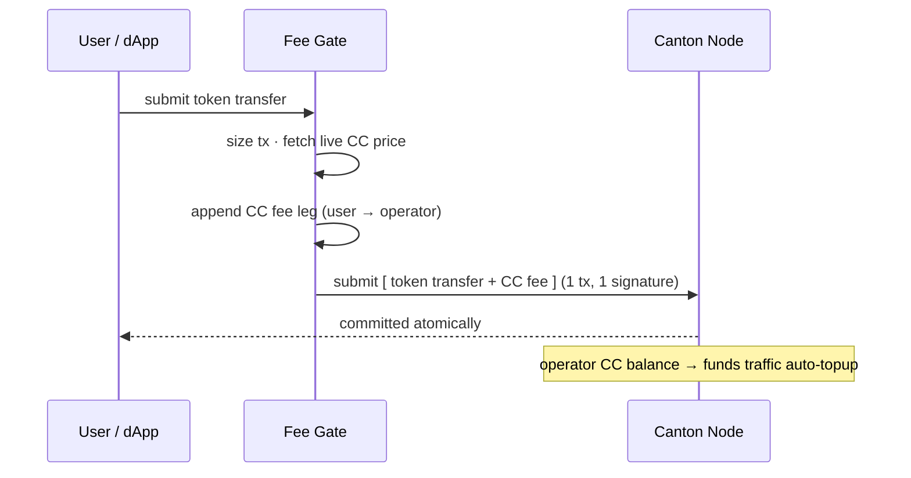
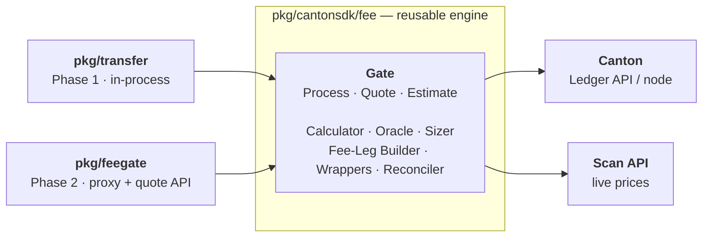
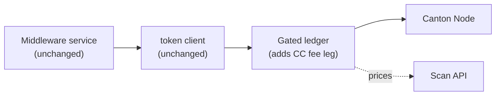
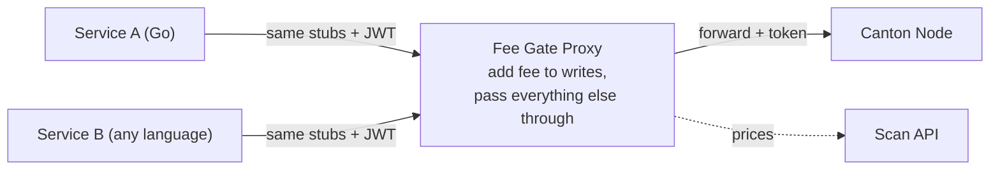
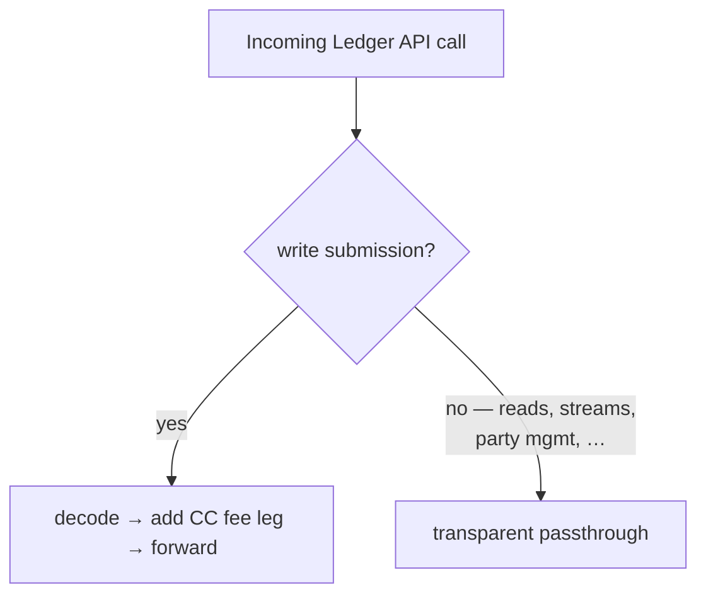

# Canton Fee Module — High-Level Design

Status: draft · Scope: distribute the participant node's Canton traffic cost to the end users who cause it.

---

## 1. The problem

Today the middleware charges **no** network fee, but the Canton node still burns **Canton Coin (CC)** to pay the synchronizer for every transaction it submits — so the operator absorbs 100% of that cost.

**Aim:** a reusable fee layer that adds a CC fee to transactions, sized so the **operator never loses** (exact cost-recovery, with margin optional).

---

## 2. Background — Canton has two fee layers



| Charge | Layer | Approx. value (governance-set) | Paid by | When |
|---|---|---|---|---|
| Extra traffic | A | ~$17–$60 / MB, burned in CC | **Node operator** | every tx over the free base rate |
| Base-rate traffic | A | free (burst allowance) | — | all participants |
| Create fee | B | $0.03 per coin output | CC sender | only on CC transfers |
| Transfer fee (stepped) | B | 1% first $100 → 0.001% > $1M | CC sender | only on CC transfers |
| Holding fee | B | ~$1 / year per coin | CC holder | holding CC |

> **Key insight:** the middleware's tokens (DEMO, PROMPT, USDCx) are **not** Canton Coin, so their transfers trigger **only Layer A traffic** — a node cost, not an automatic user charge. Making the user pay is a middleware construct.

---

## 3. The core idea

Bundle a **CC fee leg** into the *same* Daml transaction as the user's transfer. One transaction → **one signature** → atomic. The operator's CC balance grows and funds the node's traffic auto-topup.



### No-loss guarantee

The user pays slightly more than the node burns; the operator nets exactly the traffic cost:

```
fee = trafficCC + amuletFeeOnFee + buffer
```

- **trafficCC** — the node's real burn: `bytes × traffic price ÷ CC price`.
- **amuletFeeOnFee** — the Layer-B fee the CC leg itself incurs, so the operator receives the full `trafficCC`.
- **buffer** — small over-collect, always rounded up ⇒ operator never underwater.

A reconciler compares real burn vs. collected CC and exposes `fee_coverage_ratio`; below 1.0 means raise the buffer.

---

## 4. Architecture — two packages

The fee **engine** is transport-free and reusable; a thin **service** wires it to the outside world.



- **Left** — the two things that use the engine: the middleware's transfer service (Phase 1) and the standalone fee service (Phase 2).
- **Middle** — the one reusable engine; `Gate` is its entrypoint, the rest are its internals.
- **Right** — what the engine reaches out to: the Canton node (submit) and Scan (prices).

- **Boundary rule:** the engine depends only on Canton API types + stdlib — never HTTP, DB, config files, or a server runtime. Anything with external I/O lives in the service.
- **Invariant:** the engine never learns *how* forwarding happens (`Gate.Process(cmds) → augmented cmds + quote`). That is exactly why Phase 2 reuses it unchanged.

---

## 5. Phase 1 — in-process library

The engine is imported by the middleware. Fees are injected by **wrapping the ledger client**, so existing services keep their logic unchanged.



**What changes:** only the wiring (build the Gate, wrap the ledger) plus one field to surface the quote in the prepare response. Token / bridge / relayer code is untouched.

**Rollout:** `Observe` (measure real cost) → `Quote-only` (show fee, collect nothing) → `Collect` (bundle CC leg, no-loss).

**Why this phase:** fastest path to value inside the middleware, and it lets us calibrate the no-loss math against real traffic **before** running any new network service.

---

## 6. Phase 2 — deployable proxy

The **same engine**, now fronted by a gRPC service that speaks the Canton Ledger API. Any service — any language — points its endpoint at the proxy and authenticates with the **same JWT** it would use against Canton.





**Why also a proxy — the reason for two deployment models:**

| | Phase 1 — library | Phase 2 — proxy |
|---|---|---|
| Integration | import a Go package | change one endpoint |
| Languages | Go only | any language |
| "No bypass" enforcement | discipline (use wrapped client) | **network isolation** (node reachable only via proxy) |
| API coverage | the calls the middleware makes | **all** Ledger API calls, incl. future ones |
| Operational cost | none (in-process) | one more service to run |
| Best when | Go-only, minimize moving parts | polyglot services, or fee must be guaranteed org-wide |

The **library** is the cheapest way to get fees inside the middleware; the **proxy** makes fee collection a **platform guarantee** no service can skip and no language is excluded from. They share one engine, so Phase 2 is a front-end — not a rewrite.

---

## 7. Prerequisites & limits

**Operator must provide:**
- A fee party holding CC, with a live `TransferPreapproval` (enables single-signature CC receipt).
- A Scan API URL for live prices.
- Validator auto-topup enabled.

**Out of scope:**
- Topology traffic (party allocation / package vetting) — operator-driven, so the operator pays.
- Users with no CC — the transaction fails fast rather than being subsidized.
